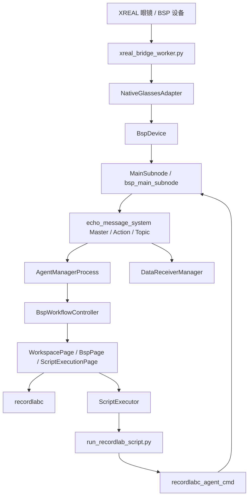
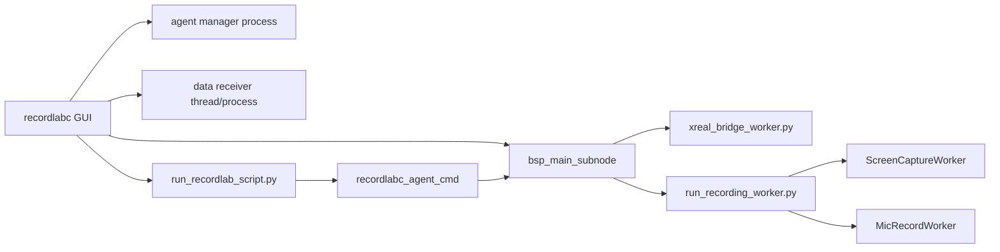
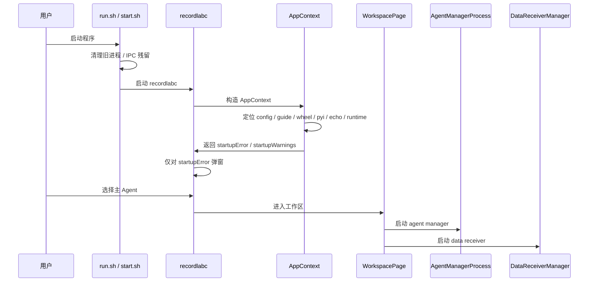
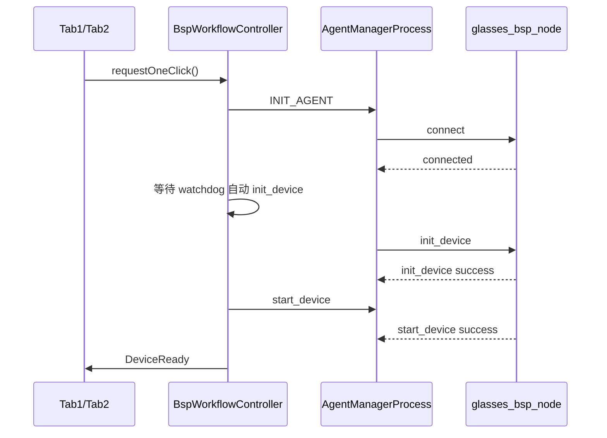

# RecordLabC 技术文档

---

## 1. 项目定位

`RecordLabC` 是对原版 `RecordLab/` 的 C++ / Qt 迁移工程。

这份迁移不是“重新做一个长得像的 UI”，而是要在不修改原版 `RecordLab/` 的前提下，建立一套可以独立运行、独立构建、独立维护的 Qt6 版本，并且尽量保持与原版一致的：

1. agent 名称
2. 主要类名和职责边界
3. command 名称
4. topic 名称
5. 数据目录结构
6. 脚本文件名
7. 录制产物命名方式

当前工程目标不是“彻底消灭 Python”，而是：

- 高频主链路尽量原生 C++ / Qt
- 低频脚本编排层继续保留 Python
- 让 Python 脚本通过新的 C++ bridge 附着到 Qt 版运行时
- 最终形成一套与原版功能一致、但运行时结构更清晰的独立工程

---

## 2. 约束与边界

### 2.1 工程约束

本工程长期遵守以下约束：

1. 不修改原版 `RecordLab/`
2. 不影响原版继续在同一台机器上运行
3. 当前目标平台固定为 Ubuntu 22.04
4. UI 与主工程使用 Qt6+
5. 真机主链路优先保证 `glasses_bsp_node`

### 2.2 迁移策略

迁移策略并不是“所有东西都翻译成 C++”，而是按频率和职责分层：

- C++ / Qt：
  - GUI
  - agent / subnode 运行时
  - 高频 IMU / Camera 接收
  - 共享内存图像链
  - 录制主控逻辑
- Python：
  - 脚本兼容运行时
  - 录制编排脚本
  - 镜片截图、录音等辅助 worker
  - XREAL runtime 桥接 worker

这样做的原因是：

1. 高频链路迁到 C++，性能收益明显
2. 编排脚本继续保留 Python，维护成本更低
3. 可以尽快复用原版实验脚本和目录契约

---

## 3. 当前工程状态

截至当前版本，`RecordLabC` 已经具备一套完整、可独立运行的 BSP 主链路，重点包括：

1. `recordlabc` 主 GUI
2. `glasses_bsp_node` 一键启动
3. 真机 IMU / 双目预览
4. 自由录与固定时长录制脚本
5. 相机快照、镜片截图、麦克风录音
6. `record_bsp_imu_cam.py` 的双目灰度图落盘
7. `doctor` / `agent_probe` / `agent_cmd` 诊断工具

同时，启动时原先用于提示“录数据指南路径”的 warning 弹窗已经移除：

- 启动错误仍会弹窗
- 非阻塞 warning 只保留在状态栏和诊断工具，不再打断用户

---

## 4. 顶层架构

### 4.1 分层结构



### 4.2 进程拓扑



### 4.3 核心原则

1. UI 和设备控制解耦
2. UI 展示频率与设备真实接收频率解耦
3. 图像大数据不走 JSON 大包重复拷贝
4. 脚本层只负责编排，不承担高频实时链路
5. 新工程优先建立自己的运行时，不回退依赖旧版 UI

---

## 5. 主要可执行文件

| 可执行文件 | 作用 |
| --- | --- |
| `build/recordlabc` | 主 GUI |
| `build/bsp_main_subnode` | BSP 主子节点 |
| `build/imu_sim_main_subnode` | IMU 仿真子节点 |
| `build/nviz_node_subnode` | NVIZ 子节点 |
| `build/recordlabc_doctor` | 启动前诊断 |
| `build/recordlabc_agent_probe` | agent / device 链路探针 |
| `build/recordlabc_agent_cmd` | Python 脚本访问 C++ agent 的桥 |

常用脚本入口：

| 脚本 | 作用 |
| --- | --- |
| `setup.sh` | 安装 Ubuntu 22.04 依赖 |
| `build.sh` | 配置并编译工程 |
| `run.sh` | 清理残留后启动 GUI |
| `start.sh` | 兼容旧使用习惯，转发到 `run.sh` |
| `doctor.sh` | 调用 `recordlabc_doctor` |

---

## 6. 目录结构与职责

### 6.1 C++ 目录

| 目录 | 职责 |
| --- | --- |
| `src/app` | 主窗口、入口页、工作区框架 |
| `src/bsp` | BSP 页面、工作流控制器、XREAL runtime 适配 |
| `src/backend` | AgentManagerProcess、DataReceiverManager、watchdog 状态整合 |
| `src/subnodes` | `MainSubnode`、BSP 录制扩展、设备命令实现 |
| `src/widgets` | 曲线绘制、数据监控、双目显示线程、图像控件 |
| `src/common` | topic 常量、共享内存、运动检测等公共组件 |
| `src/script` | 脚本执行页 |
| `src/flowagent` | agent 抽象、脚本执行器 |
| `src/tools` | `doctor`、`agent_probe`、`agent_cmd` |

### 6.2 Python 目录

| 目录 | 职责 |
| --- | --- |
| `scripts/runtime` | 脚本兼容运行时、辅助录制 worker 启动入口 |
| `scripts/common` | 屏幕截图、录音、路径命名、辅助工具 |
| `scripts/record_*.py` | 实验录制脚本 |
| `scripts/check_environment.py` | 环境检查 |
| `scripts/xreal_bridge_worker.py` | XREAL Python runtime 桥接进程 |

---

## 7. 启动流程

### 7.1 总体启动顺序



### 7.2 `AppContext` 的职责

`AppContext::create()` 负责启动前的本地发现与预检：

1. 发现当前工程根目录
2. 定位本地 `config/agents_config.json`
3. 定位 BSP 使用指南、vendored wheel、`XrGlasses.pyi`
4. 检查 XREAL runtime 是否可用
5. 生成：
   - `startupError`
   - `startupWarnings`
   - `LegacyPaths`
   - `AppConfig`

当前策略：

- `startupError` 仍然阻断启动并弹窗
- `startupWarnings` 只作状态栏提示，不再弹窗

---

## 8. BSP 一键启动状态机

### 8.1 `BspWorkflowController`

`BspWorkflowController` 是 BSP 相关页面共享的控制中枢，它统一接管：

1. 一键启动
2. Connect
3. `init_device`
4. `start_device`
5. `start_record`
6. `stop_record`
7. 急停
8. watchdog 状态汇总

这样 Tab2、Tab3、脚本页不再各自维护一份 BSP 生命周期逻辑。

### 8.2 状态枚举

当前状态枚举如下：

1. `Idle`
2. `CheckingConnection`
3. `AgentConnecting`
4. `WaitingWatchdog`
5. `DeviceInitializing`
6. `WaitingStartDeviceResponse`
7. `DeviceReady`
8. `RecordingRequested`
9. `Failed`
10. `EmergencyStop`

### 8.3 一键启动时序



### 8.4 为什么 init_device 只由 watchdog 触发

为对齐 Python 版稳定链路，`init_device` 只由 watchdog 在主 agent `check` 恢复后自动触发。

`BspWorkflowController` 只负责：

- Connect 主 agent
- 等待 watchdog 汇报 `initializing` / `healthy`
- watchdog 变为 `healthy` 后再发 `start_device`

如果 watchdog 长时间没有完成初始化，一键流程会超时失败，而不会从 UI 侧补发 `init_device`。

---

## 9. Agent、Subnode 与通信平面

### 9.1 当前通信平面

工程当前仍基于 `echo_message_system` 做：

1. master 服务发现
2. topic 发布 / 订阅
3. action / command 调用

这与原版的主通信平面保持了一致的整体模型，但 Qt 版在执行路径和 UI 组织上做了重构。

### 9.2 `AgentManagerProcess`

`AgentManagerProcess` 负责：

1. 管理主 agent 生命周期
2. 统一执行 `init_agent` / `send_agent_command`
3. 将 backend 的结果回传给页面层

页面层不直接操作底层 agent，只通过：

- `BspWorkflowController`
- `ScriptExecutor`

间接发送动作。

### 9.3 关键 command 契约

当前 BSP 主链路中，以下 command 是重点稳定契约：

| command | 说明 |
| --- | --- |
| `check` | 健康检查 |
| `estop` | 急停 |
| `init_device` | 初始化设备 |
| `start_device` | 启动数据流 |
| `stop_device` | 停止设备 |
| `start_record` | 开始录制 |
| `stop_record` | 停止录制 |
| `delete_record` | 删除录制目录 |
| `get_runtime_state` | 脚本侧同步读取运行态 |
| `get_glasses_config` | 获取眼镜配置 |
| `get_firmware_version` | 获取固件信息 |

### 9.4 关键 topic 契约

| topic | 说明 |
| --- | --- |
| `imu_data` | IMU 数据 |
| `camera_data` | 双目相机 metadata |
| `record_timer` | 当前录制时长 |
| `time_delay` | 当前延迟 |
| `motion_status` | 运动状态 |

---

## 10. 设备链路

### 10.1 `NativeGlassesAdapter`

`NativeGlassesAdapter` 是 XREAL Python runtime 和 C++ 运行时之间的桥。

它的职责：

1. 发现可用的 XREAL runtime
2. 校验 wheel、`XrGlasses.pyi`、runtime 版本
3. 拉起 `xreal_bridge_worker.py`
4. 通过二进制 frame 协议与桥接 worker 交互
5. 将 IMU / camera event 转成 C++ 可消费事件

### 10.2 为什么要引入桥接 worker

原因有三点：

1. XREAL 设备运行时本身依赖 Python 环境
2. 直接把该依赖塞进 Qt GUI 会让启动和隔离变得很脆弱
3. 通过桥接 worker，可以把设备访问和 GUI 运行时隔离开

### 10.3 `BspDevice`

`BspDevice` 是对设备能力的 C++ 抽象层，用于承接：

1. create / open / close
2. start / stop sensors
3. IMU / camera callback 注册

设备适配逻辑尽量停留在这一层，不向 UI 或脚本层泄漏。

---

## 11. IMU 数据链

### 11.1 数据路径

```text
眼镜 IMU
  -> xreal_bridge_worker.py
  -> NativeGlassesAdapter
  -> BspDevice
  -> MainSubnode::imuDataCallback
  -> 发布 imu_data / record_timer / time_delay / motion_status
  -> DataReceiverProcess
  -> DataReceiverManager
  -> DataMonitorWidget
  -> SimpleCurvePlotWidget / 文本显示 / 频率显示
```

### 11.2 `MainSubnode::imuDataCallback`

这一层负责：

1. 接收真实 IMU 数据
2. 发布统一 topic
3. 录制时写入 IMU CSV
4. 更新录制计时
5. 发布 `motion_status`
6. 发布 `time_delay`

### 11.3 `DataReceiverManager`

这一层有两个重要原则：

1. 真实接收频率与 UI 展示频率分离
2. backlog 时优先保最新值，不做历史回放

当前实现要点：

- topic 常驻订阅
- 每路维护最新值
- 短 pending 队列
- backlog 过大时丢最旧项
- 曲线样本按批量提交给 UI

### 11.4 曲线显示的设计目标

当前 `DataMonitorWidget` + `SimpleCurvePlotWidget` 的职责拆分是：

- `DataMonitorWidget`：
  - 维护最新值文本
  - drain 曲线缓冲
  - 管理当前选中的曲线订阅
- `SimpleCurvePlotWidget`：
  - 只画短时间窗口
  - 控制时间轴
  - 处理批量样本追加

设计目标是尽量收敛到原版 RecordLab 的体验：

1. 曲线显示短窗口
2. UI 只看“当前最新的一段”
3. 不因为积压而把实时曲线拖成历史回放

---

## 12. 相机链路

### 12.1 为什么要用共享内存

双目图像是本工程里数据量最大的链路之一。

如果继续沿用“每帧图像转 JSON / base64 / signal-slot 大对象”这类方式，会带来：

1. 大量内存复制
2. 主线程事件队列堆积
3. 相机预览拖累 IMU 曲线
4. 录制和显示相互干扰

因此当前版本采用：

- topic 只发 metadata
- 图像主体走共享内存

### 12.2 共享内存布局

`CameraSharedMemoryWriter` / `CameraSharedMemoryReader` 负责共享内存图像平面。

内存布局大致是：

```text
[slotSeqs atomic array][cam0 slots...][cam1 slots...]
```

每个 slot 中包含：

1. 固定大小 frame meta
2. 图像数据 payload

元数据字段包括：

- width
- height
- format
- dataSize
- bytesPerLine
- encodedFormat

### 12.3 实时预览链

```text
bridge camera event
  -> NativeGlassesAdapter
  -> CameraSharedMemoryWriter::writeFrame
  -> MainSubnode 仅发布 metadata + shm_seq
  -> DataReceiverManager
  -> CameraDisplayThread
  -> CameraSharedMemoryReader::readLatestFrame
  -> ImageDisplayWidget
```

### 12.4 为什么 UI 只拿 metadata

因为 UI 的目标是“看当前最新帧”，而不是“拿到每一帧的完整图像大包”。

所以现在：

1. metadata 用于告诉 UI 有新帧到了
2. 真正显示时，显示线程自行从共享内存回读最新帧
3. 如果上一帧尚未消费，则旧帧可以跳过

这是一种明显偏向实时性的策略。

---

## 13. 录制链路

### 13.1 `start_record`

`MainSubnode::cmdStartRecord()` 的核心流程是：

1. 创建数据集目录
2. 初始化 IMU writer
3. 根据参数决定是否开启：
   - `ImageDataWriter`
   - `CameraSnapshotWorker`
   - `ScreenCaptureWorker`
   - `MicRecordWorker`
4. 进入 recording 状态
5. 初始化计时状态和运行态缓存

### 13.2 `stop_record`

停止录制时会依次做：

1. 停止 IMU / 图像写入
2. 停止相机快照 worker
3. 停止屏幕截图 worker
4. 停止录音 worker
5. 执行 BSP 专属收尾逻辑

### 13.3 BSP 专属收尾

`bsp_main_subnode.cpp` 侧的收尾动作包括：

1. 获取 `glass_config.json`
2. 写入 `record_info.txt`
3. 收尾设备附属信息

### 13.4 为什么停止录制不能简单粗暴杀进程

因为录制停止不只是“停止出数”，还涉及：

1. 文件 flush
2. 结束快照
3. 结束录音
4. 拉取配置
5. 更新产物完整性

所以脚本页的“停止脚本”和 `stop_record` 是两层语义：

- “停止脚本”是停止编排层
- `stop_record` 是停止录制链并完成收尾

---

## 14. 录制辅助 worker

### 14.1 `CameraSnapshotWorker`

职责：

1. 保存 `cam_start.png`
2. 每分钟保存一次 `cam_{n}min.png`
3. 停止时保存 `cam_end.png`
4. 每秒写一行 `camera_rgb.csv`

当前实现分为两种：

- C++ 原生 `CameraSnapshotWorker`
- Python 辅助 worker 链中的其他录制能力

### 14.2 `ScreenCaptureWorker`

职责：

1. 通过眼镜侧 `display_debug capture` 触发镜片截图
2. 读取 `/usrdata/dump_vi_*.yuv`
3. 转换成 PNG
4. 落盘到 `screenshots/`
5. 周期性写 `record_screen_rgb_info.csv`

### 14.3 `MicRecordWorker`

职责：

1. 调用本机录音设备
2. 录制为 `mic_record.wav`
3. 跟随录制开始 / 停止

### 14.4 `run_recording_worker.py`

它是 Python 辅助录制 worker 的统一入口，负责：

1. 初始化具体 worker
2. 汇报 ready 状态
3. 接受停止信号
4. 有序退出

当前版本已经不是“Python 进程启动了就算成功”，而是：

- worker 真正 ready 后才算启动成功
- 启动失败会把错误回传给 C++ 侧

---

## 15. 脚本兼容运行时

### 15.1 为什么不能继续直接用旧 Python ActionClient

原版 Python UI 的 `ActionClient` 与当前 C++ agent 通信机制并不完全兼容。

如果脚本继续直接去连旧模型的固定 port，会遇到：

1. action server 不可用误判
2. topic 订阅时机不稳定
3. `record_timer()` 总是落后一拍

### 15.2 当前方案

当前脚本运行时链路为：

```text
ScriptExecutionPage
  -> ScriptExecutor
  -> run_recordlab_script.py
  -> recordlabc_agent_cmd
  -> C++ agent
```

### 15.3 `run_recordlab_script.py` 的职责

它提供一个“最小但够用”的兼容环境，使旧脚本还能继续写成：

- `glasses_bsp_node.cmd(...)`
- `record_timer()`
- `motion_status()`
- `time_delay()`
- `dialog.multi_field_input(...)`

### 15.4 `get_runtime_state`

`record_timer()`、`motion_status()`、`time_delay()` 当前优先通过：

```text
recordlabc_agent_cmd --cmd get_runtime_state
```

同步读取，而不是每次临时订阅 topic。

这么做的直接收益：

1. 录制计时器更接近真实时间
2. 脚本日志打印间隔更稳定
3. 避免“为了拿一条状态，反而等下一帧 topic”带来的额外延迟

---

## 16. 脚本执行页

### 16.1 两种模式

`ScriptExecutionPage` 支持两种模式：

1. 单脚本模式
2. 批量执行模式

### 16.2 页面的职责

它不仅是脚本列表 UI，还负责：

1. 加载脚本
2. 配置实验关键字与录制人
3. 启动 / 停止脚本
4. 显示执行日志
5. 与 `BspWorkflowController` 联动

### 16.3 与一键启动的协同

脚本页并不是完全独立的第二套启动系统。

当前协同方式是：

1. 优先让 `glasses_bsp_node` 进入 `DeviceReady`
2. 脚本页自动复用当前就绪的 agent
3. 不再自己重复走一套旧式 Python agent 初始化逻辑

---

## 17. 兼容契约

### 17.1 必须长期保持一致的内容

以下内容建议视为强兼容契约：

1. 主 agent 名称：`glasses_bsp_node`
2. topic 名称：
   - `imu_data`
   - `camera_data`
   - `record_timer`
   - `time_delay`
   - `motion_status`
3. 主要 command 名称
4. 数据集目录命名规则
5. `scripts/record_bsp_*.py` 文件名
6. 输出目录层级和主要文件名

### 17.2 允许内部重构的内容

以下内容可以调整实现，但不能破坏外部行为：

1. 线程模型
2. 共享内存内部布局细节
3. UI 控件底层实现
4. C++ / Python 辅助 worker 的协作方式
5. 页面的内部组织方式

---

## 18. 数据目录与产物

### 18.1 目录命名规则

数据集目录最后一级命名格式：

```text
<眼镜SN>_<实验关键字>_<录制人>_<子实验路径token>_<时间戳>
```

例如：

```text
L551X00179_exp_recorder_free_record_only_imu_20260414174156
```

### 18.2 主要脚本产物

#### `record_bsp_imu.py`

```text
data/free_record/only_imu/<dataset>/
├── imu_0.csv
├── imu_1.csv
├── record_info.txt
├── glass_config.json
├── camera_rgb.csv
├── cam0/snapshots/
├── cam1/snapshots/
├── record_screen_rgb_info.csv
├── screenshots/
└── mic_record.wav
```

#### `record_bsp_imu_cam.py`

在上面的基础上增加：

```text
cam0/images/
cam1/images/
```

每路 `images/` 下通常包含：

1. PGM 图像序列
2. `timestamps.txt`
3. `metadata.txt`

---

## 19. 性能收敛策略

这部分是后续维护最容易被破坏的地方。

### 19.1 IMU 显示

当前策略：

1. 原始消息一到先做频率统计
2. UI 只接收抽帧后的展示流
3. pending 队列保持短队列
4. backlog 时丢旧保新
5. 曲线用批量样本更新，不逐点重绘

### 19.2 相机预览

当前策略：

1. 图像主体走共享内存
2. 显示线程读最新帧
3. 若上一帧尚未消费，允许跳过旧帧
4. 统计信息尽量在缩放后小图上计算

### 19.3 脚本计时与状态查询

当前策略：

1. 优先同步查询 `get_runtime_state`
2. 避免每次临时订阅 topic
3. 减少脚本日志打印与真实运行态的相位差

### 19.4 录制辅助 worker

当前策略：

1. worker ready 后才算真正启动成功
2. 启动失败必须尽早暴露
3. 停止时优先完整收尾，而不是粗暴终止

---

## 20. 构建、运行与诊断

### 20.1 构建

```bash
./build.sh
```

或：

```bash
cmake --build build
```

### 20.2 启动

```bash
./start.sh
```

### 20.3 诊断

```bash
python3 scripts/check_environment.py --json
./doctor.sh --json
build/recordlabc_agent_probe
```

### 20.4 常见排查顺序

真机问题建议按以下顺序排查：

1. 先看设备是否进入 `DeviceReady`
2. 再看脚本是否走到了 C++ bridge
3. 再看数据目录是否真的落出了文件
4. 最后再看 UI 表现是否理想

因为：

- UI 表现异常不一定等于录制失败
- 但目录没产物，一定说明录制链有断点

---

## 21. 回归测试清单

每次涉及以下模块的修改后，都建议至少做一次真机回归：

1. `NativeGlassesAdapter`
2. `MainSubnode`
3. `DataReceiverManager`
4. `CameraSharedMemory*`
5. `run_recordlab_script.py`
6. `run_recording_worker.py`
7. `ScreenCaptureWorker`
8. `MicRecordWorker`

建议回归项：

1. 程序能正常启动，且启动 warning 不再弹框
2. `一键Glasses_bsp_node` 能进 `DeviceReady`
3. IMU 频率正常
4. 双目图像正常显示
5. `record_bsp_imu.py` 可录出完整目录
6. `record_bsp_imu_cam.py` 可录出 `cam0/images/` 与 `cam1/images/`
7. `screenshots/` 与 `record_screen_rgb_info.csv` 正常
8. `mic_record.wav` 正常
9. 停止脚本后能正常收尾

---

## 22. 后续维护建议

### 22.1 新功能放在哪里

建议原则：

- 设备能力：放 `subnodes` / `bsp`
- UI 展示：放 `widgets` / `app` / `script`
- 高速数据通道：优先 C++ + 共享内存
- 编排层：优先脚本兼容运行时

### 22.2 不建议的改法

以下改法长期看风险很高：

1. 把设备控制直接写死进页面按钮槽函数
2. 让 UI 线程直接消费大图字节流
3. 让脚本重新绕回旧版 Python ActionClient 固定端口模式
4. 让多条链路各自维护一份 BSP 生命周期状态

### 22.3 推荐的改法

1. 所有 BSP 生命周期动作优先走 `BspWorkflowController`
2. 图像类性能优化优先考虑共享内存和背压
3. 脚本需要新状态时，优先补 `get_runtime_state`
4. 产物格式变化前，先确认兼容契约是否允许修改

---

## 23. 结论

`RecordLabC` 现在已经不是一个“只把原版页面翻成 Qt 的壳工程”，而是一套具备以下特征的独立系统：

1. 自己的 GUI
2. 自己的 BSP 生命周期控制器
3. 自己的 agent / subnode 运行时
4. 自己的图像共享内存链
5. 自己的脚本兼容运行时
6. 自己的录制辅助 worker 体系
7. 自己的诊断与回归入口

后续继续维护时，最重要的是守住三条线：

1. 对外兼容契约不要轻易破坏
2. 高频链路不要退回到大对象重复拷贝
3. 脚本编排层与设备主链路继续保持解耦

只要这三条线不丢，`RecordLabC` 就能继续稳定向“正式可维护的 C++ / Qt 版本”推进。
